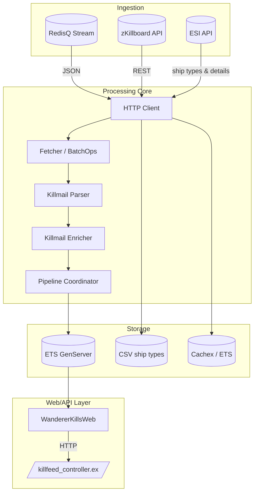
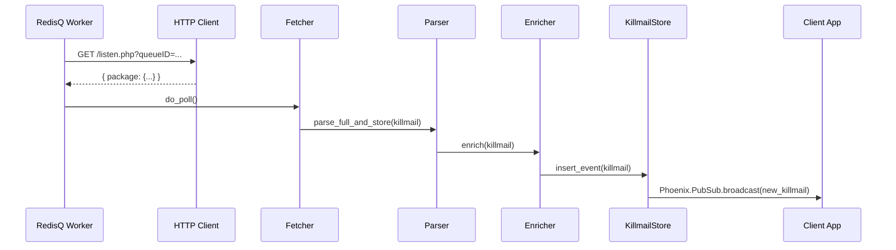
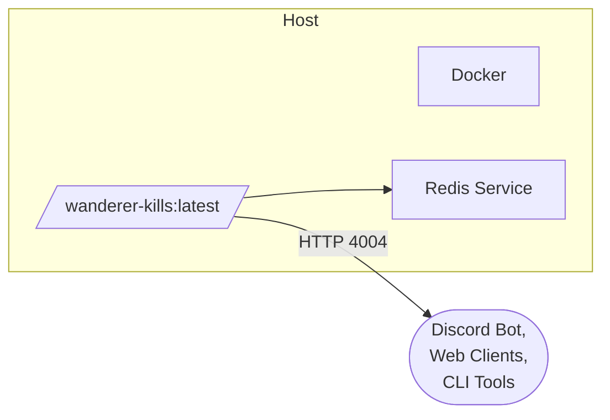

## 1. Overview

The **WandererKills** system ingests real-time and historical killmail data from EVE Online, enriches it, stores it for query and distribution, and exposes it via both in-process APIs and a Phoenix-based web API.

Key high-level flows:

1. **Data Ingestion**

   - **RedisQ Stream** (real-time)
   - **zKillboard API** (historical/backfill)
   - **ESI API** (supplemental details)

2. **Processing Pipeline**

   - Fetcher → Parser → Enricher → Store

3. **Storage & Distribution**

   - ETS-backed GenServers (KillmailStore)
   - Phoenix PubSub for real-time updates
   - HTTP endpoints for back-fill and polling

4. **Web/API Layer**
   - `WandererKillsWeb` Phoenix application exposes `/api/killfeed`

---

## 2. Contexts & Module Layout

```text
lib/wanderer_kills/
├── cache/            # Cache helpers & error types
├── data/             # Behaviour & implementations for ship type sources
├── esi/              # ESI data structs & client source
├── external/         # External integrations (ESI client, ZKB fetcher/RedisQ)
├── fetcher/          # Batch & coordinated fetching logic
├── http/             # Core HTTP client with rate-limit & retry
├── infrastructure/   # Core infra: ETS supervisor, CircuitBreaker, Clock, Config
├── killmails/        # Killmail pipeline: parser, enricher, coordinator, store
├── observability/    # Health checks & telemetry instrumentation
├── preloader/        # Supervisor & worker for historical preload
├── schema/           # Ecto schemas (if any) or data definitions
├── shared/           # Shared constants, CSV helpers, parsers
├── ship_types/       # CSV and ESI ship-type parsing & updating
├── systems/          # Solar system fetcher
└── zkb/              # zKillboard client behaviour & impl
```

---

## 3. Component Diagram



---

## 4. Data Flow Sequence



---

## 5. Deployment & Containers



- **Dev Container** configured via `.devcontainer/Dockerfile` & `.devcontainer/docker-compose.yml`
- **CI/CD** builds and tests in GitHub Actions, then pushes Docker images upon merging to `main`

---

## 6. Recommendations for Next Steps

- **Domain-Driven Modules**: Encapsulate each context (`killmails`, `ship_types`, `external`) as its own OTP application or supervision tree for clearer boundaries.
- **Diagram Maintenance**: Generate up-to-date diagrams with Mermaid Live Editor.
- **Add a Unified Sequence for ZKB Back-fill**: Mirror the above flow but via `WandererKills.External.ZKB.Fetcher`.
- **Document Telemetry Events**: Provide a reference table of all emitted `:telemetry.execute` events.
- **API Extensions**: Plan GraphQL or additional REST endpoints under `WandererKillsWeb` for richer querying of stored killmails.
